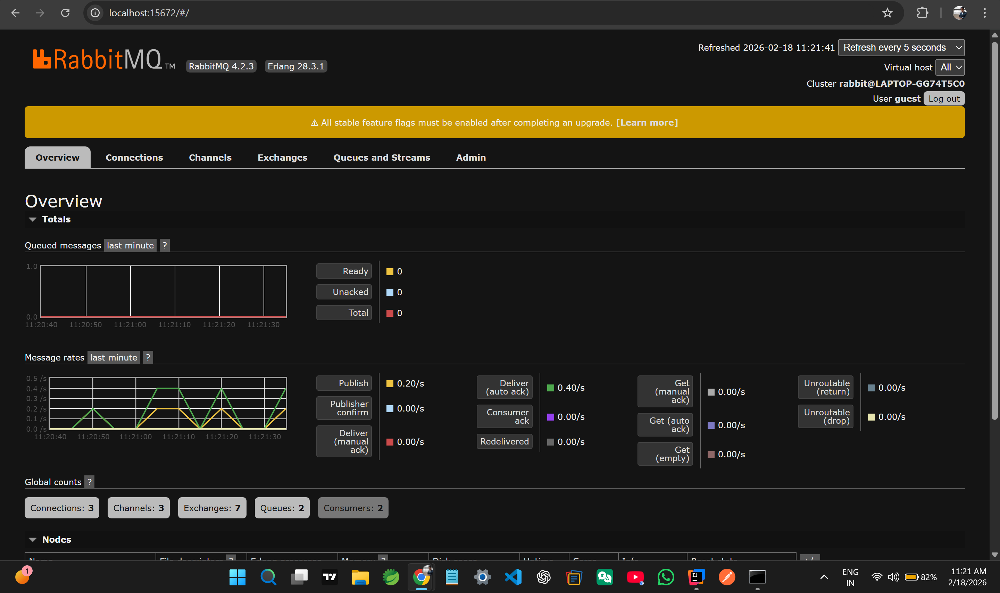
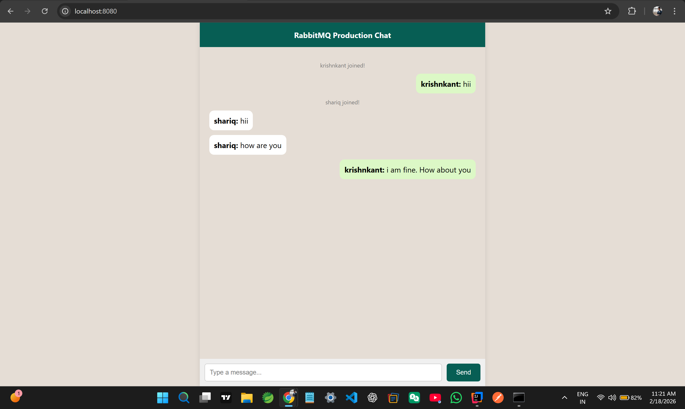

# 🚀 Real-Time Scalable Chat Application

## 📌 Introduction & Purpose
This project is a **Real-Time Chat Application** built using **Spring Boot** and **WebSockets**.

Unlike traditional HTTP requests where the client has to keep asking the server for new messages (Polling), this application uses **WebSockets** to create a persistent, two-way connection. This ensures that messages are delivered instantly with minimal latency.

To make the application **Production-Ready and Scalable**, I have integrated **RabbitMQ** as an external message broker instead of using the default in-memory broker.

---

## 🛠 Tech Stack
* **Backend:** Java, Spring Boot (WebSocket Starter)
* **Message Broker:** RabbitMQ (with STOMP Plugin enabled)
* **Protocol:** STOMP (Simple Text Oriented Messaging Protocol)
* **Frontend:** HTML, JavaScript, SockJS, Stomp.js
* **Build Tool:** Maven

---

## 🧠 R&D: Why RabbitMQ? (Architecture Decision)

During the development, I explored two approaches for message routing:

### 1. In-Memory Broker (SimpleBroker) - *The Initial Approach*
* **How it works:** Messages are stored in the Java application's RAM (JVM Heap).
* **Problem:** It works fine for a single server. However, if we scale the application (e.g., run it on 2 servers), User A connected to Server 1 cannot chat with User B connected to Server 2. The messages get lost because servers don't share memory.

### 2. External Broker (RabbitMQ) - *The Chosen Approach* * **How it works:** I used `enableStompBrokerRelay`. The Spring Boot app acts as a gateway. It takes the message and pushes it to the **RabbitMQ Server**.
* **Benefit:** RabbitMQ handles the routing. Even if we have 100 Spring Boot servers, they all talk to the same RabbitMQ instance, ensuring **Data Consistency and Scalability**.
* **Decoupling:** The chat system is now loosely coupled. The server is not burdened with holding messages in RAM.

---

## ⚙️ Implementation Details

### 1. WebSocket Configuration
I configured the `WebSocketMessageBrokerConfigurer` to set up the connection endpoints.
* **Endpoint:** `/ws` (with SockJS fallback for older browsers).
* **Broker Relay:** Configured to connect to RabbitMQ on port `61613` (STOMP port).

### 2. Session Management (User Join/Leave)
One challenge was detecting when a user closes the browser tab.
* **Solution:** I used `WebSocketEventListener`.
* **On Join:** I store the `username` in the WebSocket **Session Attributes** (Server's temporary memory).
* **On Disconnect:** The event listener triggers, retrieves the username from the session, and broadcasts a `LEAVE` message to all active users.

### 3. Frontend Logic
Used **SockJS** and **Stomp.js** to establish the connection. The UI handles dynamic message bubbles (Green for me, White for others).

---

## 🚀 How to Run Locally

### Step 1: Start RabbitMQ
You need RabbitMQ running with the STOMP plugin enabled.
If using Docker, run:
```bash
docker run -d --name rabbitmq-server -p 5672:5672 -p 15672:15672 -p 61613:61613 rabbitmq:3-management
docker exec -it rabbitmq-server rabbitmq-plugins enable rabbitmq_stomp

(Or install manually on Windows and enable the plugin).

Step 2: Run Spring Boot App
Clone the repository and run the application:

Bash
mvn spring-boot:run
Step 3: Open the Chat
Open your browser and navigate to:
http://localhost:8080

Open the URL in two different tabs (or Incognito mode) to simulate two users chatting.

📊 Proof of Concept (Results)
RabbitMQ Dashboard: Shows active connections and message spikes in the graph.

Console Logs: Shows "User Joined" and "User Disconnected" events successfully.

🔮 Future Improvements
Implement Database Storage (MySQL/MongoDB) to save chat history.

Add Private 1-to-1 Chat logic.

Implement JWT Authentication for secure connections.

Created by Krishnkant Malviya


